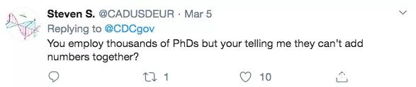

# 第二章 Python是什么

1. 编程语言

人类通过使用计算机可以理解的语言来告诉它要去做什么。
编程语言分为三类：

* 机器语言（二进制编码指令集）
* 汇编语言（使用助记符等特定符号来替代机器指令）
* 高级语言（面向过程或者对象的语言，如：c、java、python等）

经常看到有人说Python是胶水语言，胶水语言就是用来连接软件组件的语言，也叫脚本语言。比如说用于前端页面HTML和后端Java语言之间的Javascript，就是一个用于解释执行而不需要编译的脚本语言。

2. 用途

我们编写的这些代码可以干嘛呢？当然是告诉计算机替我们去干活儿啊。比如小学都学过如何计算从1加到100。小时候学到的计算方法是：1+100+2+99+3+98+...+50+51，也就是50对101，相乘结果就是5050。那么如何使用程序告诉计算机来进行计算呢？如下：

    ```python
    i = 1
    s = 0
    while i<101:    #while循环直至i=100;
        s = s + i
        i = i + 1
    print(s)
    ```

    上面我们用了一个循环来实现，那么还有没有更加简单的写法呢？在Python里我们可以用内置函数来实现计算：

    ```python
    print(sum(range(1,101)))
    ```

    以上两段代码运行的结果都是5050，当然，对于有基础的同学一眼就能明白，但是对于刚开始接触编程的同学也不要着急，相信很快你就可以明白这些代码的意思。

3. 目的

大家决定要花费时间精力去学习一门新语言的目的各有不同，有的是为了提升自己、有的是为了扩展视野、也有为了跳槽可以拿高薪、当然还有就是听说很火很洋气想要试一试。作为2500多种高级语言中的一个，Python可以做的事情其他语言都可以实现，

那么为什么还要学习python呢？Python的应用场景大多为一些看起来非常专业以及高端的应用领域，比如：数据分析、人工智能。当然你要说我非得拿Python去做Web开发，当然没问题，目前也有许多线上项目是这样实现的。要知道，对于我们人类来说，编程语言只是一个和计算机进行交流沟通的工具，就像学好西班牙语就可以去南美洲横行一样的。

以这次冠状病毒疫情为例，全球的可视化数据展示大多是使用Python来开发的，因为确实够简单。大家如果搜索：convid-19 + python，就会发现大把的相关教程指南。中国的最新数据是由国家卫健委统一更新发布，民间的数据源大多使用了丁香园的统计结果。而全球的数据发布渠道太多，二百多个国家地区的数据如何进行收集、整理、可视化？使用爬虫定时自动爬取数据源就方便很多了。这里吐槽一下美国的疫情数据，CDC发布通知说由于周末要休息，无法及时统计各州数据，所以不再做美国疫情数据实时更新，呵呵


最后由JHU约翰斯霍普金斯大学领导生物安全流动性跨学科研究的副教授 Lauren Gardner 博士带着她的两位中国博士生董恩盛和杜鸿儒开发完成的，这个可视化的全球疫情地图最终成了全球共用的美国疫情数据源。


之前做过的项目中也涉及许多爬虫的应用，由于我有一位大牛合伙人，所以这部分工作几乎都是由他来完成，所以我就没有过多的涉及。而当我自己开始学习Python语言时，一开始的兴趣点也是用它来爬数据，比如爬取豆瓣电影信息，爬取小说网站的内容，爬取图片素材等等，当然仅用来做测试和练习使用。

目前人工智能的深度学习最为流行的机器学习框架就数Google的TensorFlow了，当然也还有一些其他的框架比如PyTorch、Caffe等等。这些我们以后再详细了解。微博上如果有关注过潘苹果的也应该知道这位前商业地产大佬也已经学习Python几个月了。作为一门编程语言，为何会有这么大的魅力，让一个中老年地产大叔也来凑个热闹呢？Python作为一门编程语言，其作用与其他语言没有太大差异，那为什么会这么火呢？总结一下有以下几个原因：

* 代码简洁易懂，可读性高，入门容易上手快；
* 有海量的代码库加以支撑，社区活力四射；
* 人工智能机器学习等热门领域的主流编程语言；
* 媒体以及培训机构疯狂追捧的功劳；

知乎上有一个回答很有意思，列出了常见热门语言之父的大头照，有兴趣的自己去看看吧！[你瞧瞧其他语言之父](https://www.zhihu.com/question/291869104/answer/824514120)

4. 其他

* [为什么到处都是hello world？](https://blog.hackerrank.com/the-history-of-hello-world/)

    Where does ‘Hello World’ come from?
    Brian Kernighan, author of one of the most widely read programming books, "C Programming Language", also created "Hello, World". He first referenced ‘Hello World’ in the C Programming Language book’s predecessor: A Tutorial Introduction to the Programming Language B published in 1973.

    ```C
    main( ) {
    extrn a, b, c;
    putchar(a); putchar(b); putchar(c); putchar(’!*n’);
    } 1 ’hell’;
    b ’o, w’;
    c ’orld’;
    ```

    Unfortunately, the legend himself can’t definitely pinpoint when or why he chose the words “Hello, World.” When asked what sparked the idea for the name “Hello, World” in interview with Forbes India, he said his memory’s dim.[ref: hackerrank.com]

* Python为什么要叫Python？
    Python名字的由来：1989年圣诞节，荷兰人Guido van Rossum为了打发时间决定开发一个新的脚本解释编程语言作为ABC语言的一种继承。之所以选中Python作为编程的名字，是因为他是BBC电视剧《蒙提·派森的飞行马戏团》的爱好者。

    “六年前，在1989年12月，我在寻找一门“课余”编程项目来打发圣诞节前后的时间。我的办公室会关门，但我有一台家用电脑，而且没有太多其它东西。我决定为当时我正构思的一个新的脚本语言写一个解释器，它是ABC语言的后代，对UNIX / C程序员会有吸引力。作为一个略微有些无关想法的人，和一个蒙提·派森的飞行马戏团（Monty Python's Flying Circus）的狂热爱好者，我选择了Python作为项目的标题。” - Guido van Rossum. 1996 [ref:wikipedia]

* Python会不会被其他语言替代？
    我也不知道。
